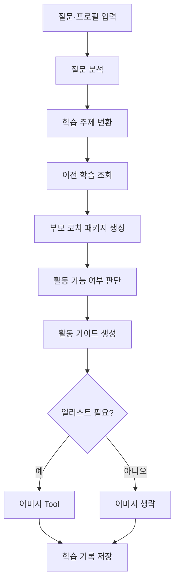

## 왜용

**만 3~6세 자녀를 둔 부모**를 위한 **호기심 학습 코치 에이전트**입니다.

왜용은 정답만 나열하는 앱이 아니라, **부모와 아이 사이의 호기심 대화를 설계**합니다.  
부모가 아이의 “왜?”를 입력하면 질문 속 **학습 주제와 호기심 의도**를 분석하고, 아이 연령·관심사에 맞춰 **바로 말할 수 있는 설명**, **대화 스크립트**, **되물을 창의 질문**, **집에서 할 놀이·실험·관찰**, **학습 이미지 카드**, **다음 호기심 주제**까지 한 흐름으로 제공합니다.

### 한 줄 목표

아이의 순수한 질문을 **일회성 답변으로 끝내지 않고**, 부모와 아이가 함께 탐구하는 경험으로 이어지게 돕는다.

### MVP 기능

1. 부모가 아이 질문 입력  
2. 질문 유형·의도 분석 (과학 / 감정 / 사회 / 민감 등)  
3. 아이 나이·관심사·설명 스타일 반영  
4. 부모가 바로 말할 **30초 답**·조금 더 긴 **이야기 답**·**놀이·그림 팁**  
5. **대화 스크립트**, **피하면 좋은 말 / 대신 말**, **되물음 3개**, **창의 질문 가이드**(관찰·상상·비교·탐구)  
6. **활동 분기**: 실험 가능 / 관찰로 대체 / 대화·역할 놀이 위주 (`ActivityFeasibility`)  
7. **안전한 놀이·실험·관찰 가이드** (`ActivityGuide`)  
8. **일러스트 필요 여부 판단** (`ImageNeedDecision`) — 감정·민감 주제 등에는 그림을 생략할 수 있음  
9. 필요할 때만 **gpt-image-1.5** Tool(`generate_education_image_card`)로 학습 그림 카드 생성  
10. **SQLite**(`learning.db`)에 호기심 기록 저장 + **다음 호기심 질문** 목록  

### 그래프 흐름



### 실행 시 입력 예시

- `question`: 아이 질문 (부모가 대신 입력)  
- `target_age`: 만 나이  
- `child_interests`: 선택, 예 `["공룡", "자동차"]`  
- `explanation_style`: 선택, 예 `"짧고 재밌게"`  
- `learner_id`: 선택, 같은 아이 기준으로 이전 기록만 보고 싶을 때  
- `child_reaction_note`: 선택, 오늘 상황 메모(저장 시 요약에 포함)  

### Streamlit MVP 실행

현재 MVP는 `main.py`를 Streamlit 앱 엔트리포인트로 사용하고, 실제 워크플로우는 `waeyong_core.py`에서 실행합니다.

1. 의존성 설치

```bash
uv sync
```

2. OpenAI 키 준비

- `.env` 또는 셸 환경변수에 `OPENAI_API_KEY`가 필요합니다.
- 이미지 카드까지 생성하려면 같은 키로 `gpt-image-1.5` 호출이 가능해야 합니다.

3. 앱 실행

```bash
uv run streamlit run main.py
```

4. 브라우저에서 확인할 수 있는 것

- 아이 프로필 입력 (`target_age`, `child_interests`, `explanation_style`, `learner_id`)
- 질문 입력 및 실행
- 질문 분석 / 학습 주제 / 부모 코치 패키지 / 활동 가이드
- 조건부 이미지 카드 표시
- 최근 학습 기록, 카테고리 필터, 선택 기록 요약

### 파일 구조

- `main.py`: Streamlit UI 엔트리포인트
- `waeyong_core.py`: LangGraph 워크플로우, SQLite 저장소, 이미지 Tool, 실행 함수
- `learning.db`: 실행 중 생성되는 SQLite 데이터베이스
- `generated/`: 생성된 이미지 카드 저장 폴더
- `tests/test_waeyong_core.py`: 코어 스모크/회귀 테스트

### 저장 경로와 주의점

- 학습 기록은 프로젝트 루트 기준 `learning.db`에 저장됩니다.
- 생성 이미지는 `generated/` 아래에 저장됩니다.
- Streamlit은 rerun이 잦기 때문에, 현재 MVP는 **제출 버튼을 눌렀을 때만** 워크플로우를 실행하도록 구성했습니다.

### 과제 요건

- LangGraph  
- LangChain **Tool** ≥ 1 (`generate_education_image_card` 등)  

### 완성도에 대한 참고

- **데모·과제 제출용 MVP**로는 현재 구조(분석 → 코치 패키지 → 활동 → 조건부 이미지 → SQLite)면 충분히 설명 가능한 수준입니다.
- **실제 서비스**로 가려면 인증·요금·프롬프트 안전·오류 처리·레이트 리밋 등이 추가로 필요합니다.

### 프론트엔드를 붙일 때

- 현재 코어는 `waeyong_core.py`로 분리되어 있어, 다음 단계에서는 **FastAPI 등으로 `run_curiosity(...)`를 감싼 API**를 두고 프론트가 호출하는 방식이 자연스럽습니다.
- 세션은 `thread_id`·`learner_id`를 요청 본문으로 넘기면 됩니다.
- 학습 기록 조회는 SQLite **`fetch_learning_records` / `list_question_categories`**를 API 핸들러에서 그대로 호출하거나, 동일 SQL을 옮기면 됩니다.

### 카테고리별 질문 보기

- 저장 시 `QuestionAnalysis.question_type`이 **`question_category`** 컬럼에 들어갑니다 (예: `과학·자연`, `감정·관계`).
- 기존 `learning.db`는 시작 시 마이그레이션으로 컬럼이 추가됩니다. **이미 저장된 옛 행**은 `question_category`가 비어 있을 수 있어, 필요하면 한 번 재실행해 저장하거나 배치로 채우면 됩니다.
